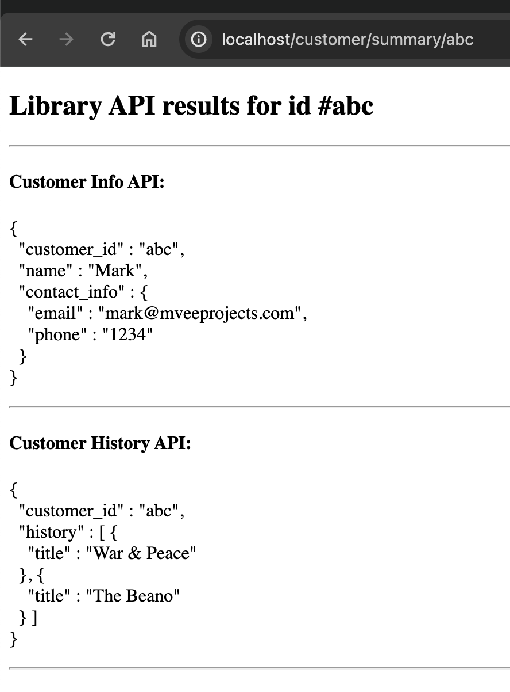

# Java Spring Boot API Proxy

Stateless UI/Proxy application used to call a series of external REST APIs and present the result back to the user.

### Tech stack
* Java 21
* Gradle 8
* Spring Boot
* Thymeleaf
* Docker
* Wiremock

### Running the application

**Docker**
* Application: `./gradlew build && docker build -t mveeprojects/java_sb_api_proxy . && docker run -d --name JavaSpringBootApiProxy -p 80:8080 mveeprojects/java_sb_api_proxy`.
* Wiremock: `docker run -d -p 8080:8080 --name wiremock -v ./wiremock/mappings:/home/wiremock/mappings wiremock/wiremock`.
* Useful command to keep an eye on running docker containers `watch -n1 'docker ps -a --format "table {{.ID}}\t{{.Names}}\t{{.Ports}}\t{{.Status}}"'`.
* To easily clean up the docker container and image, run `docker rm -f $(docker ps -aq) &&  docker rmi -f mveeprojects/java_sb_api_proxy`.

**Docker Compose**
* `./gradlew build && docker-compose down && docker rmi -f javaspringbootapiproxy-application && docker-compose up -d`.
* An executable script has been written for convenience, run `./startup.sh` from the root of the project to stop and start the application and wiremock.
  
Once running, the app will be available at localhost on port 80, wiremock will be available on port 8080.

### Endpoints

**Customer Summary Frontend (index.html):** 

Example call with `customer_id` "abc":
* http://localhost/customer/summary/abc.

Returns all proxied API responses for a given customer_id ("abc", see wiremock endpoints below) to the frontend, as shown below.

### Wiremock

Mappings are stored as JSON under the [wiremock/mappings](./wiremock/mappings) directory.

* View all mappings
  * http://localhost:8080/__admin/mappings
* API for customer account information; customer_id, name, etc. (customer_id "abc")
  * http://localhost:8080/customer/info/abc
* API for info on history of books borrowed by a given customer (customer_id "abc")
  * http://localhost:8080/customer/history/abc

### Sources
* mveeprojects.wordpress
  * [Good Thymes with Spring Boot](https://mveeprojects.wordpress.com/2017/11/11/good-thymes-with-spring-boot/).
* Spring.io
  * [Spring Boot getting started guide](https://spring.io/guides/gs/spring-boot).
  * [Spring Boot Gradle Plugin Reference Guide](https://docs.spring.io/spring-boot/docs/current/gradle-plugin/reference/htmlsingle/).
  * [Spring Boot Docker](https://spring.io/guides/topicals/spring-boot-docker)
* Java HTTP Client
  * https://www.baeldung.com/java-9-http-client
* Miscellaneous
  * [SO: Keeping JSON whitepaces (pretty printing) in Thymeleaf](https://stackoverflow.com/questions/62822117/displaying-pretty-printed-json-from-variable-with-java-spring-boot-thymeleaf) 

### Todo

Must-haves:
* [x] Run dockerised wiremock instance with mocked JSON response of an external REST API.
* [x] Run the application and wiremock together in docker-compose.
* [x] Add code to call the external API and send the JSON to the frontend.
* [x] Render JSON of external API in "pretty print".
* [ ] Add basic auth to external API call.
* [ ] Create a simple UI using Thymeleaf.
  * [ ] Text box and button for user input instead of path variables on frontend.
  * [ ] Handle errors gracefully (400, 401, 404 etc.).
* [ ] Add PII to external API response JSON and obfuscate before sending in response to the frontend.

Nice-to-haves:
* [ ] Add equivalent curl (without auth) to the UI.
