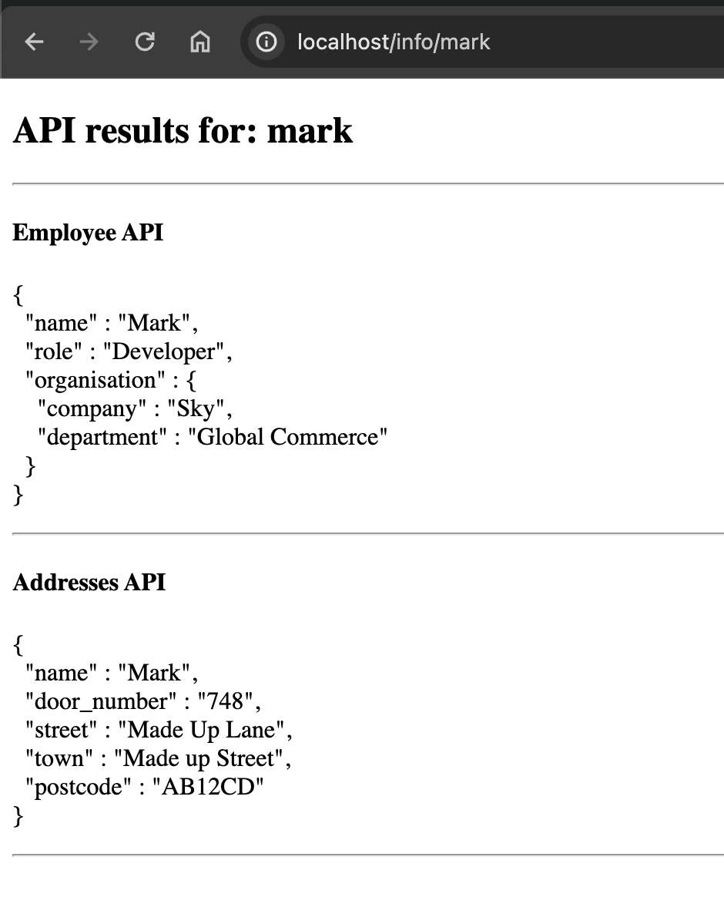

# Java Spring Boot API Proxy

Stateless UI/Proxy application used to call a series of external REST APIs and present the result back to the user.

### Tech stack
* Java 21
* Spring Boot
* Thymeleaf
* Docker
* Wiremock

### Running the application

#### IntelliJ
* Click run on the [Application class](./src/main/java/org/mveeprojects/Application.java).

#### Gradle Plugin
* `./gradlew bootRun`.

**Docker**
* Application: `./gradlew build && docker build -t mveeprojects/java_sb_api_proxy . && docker run -d --name JavaSpringBootApiProxy -p 80:8080 mveeprojects/java_sb_api_proxy`.
* Wiremock: `docker run -d -p 8080:8080 --name wiremock -v ./wiremock/mappings:/home/wiremock/mappings wiremock/wiremock`.
* Useful command to keep an eye on running docker containers `watch -n1 'docker ps -a --format "table {{.ID}}\t{{.Names}}\t{{.Ports}}\t{{.Status}}"'`.
* To easily clean up the docker container and image, run `docker rm -f $(docker ps -aq) &&  docker rmi -f mveeprojects/java_sb_api_proxy`.

**Docker Compose**
* `./gradlew build && docker-compose down && docker rmi -f javaspringbootapiproxy-application && docker-compose up -d`.
* an executable script has been written to cover this, run `./startup.sh` for convenience.
  
Once running, the app will be available at localhost on port 80, wiremock will be available on port 8080.

### Endpoints

**UI/index:** http://localhost/

**API:** http://localhost/info/<name>

Returns all proxied API responses for a given name (mark, see wiremock endpoints below) to the frontend, as shown below.

[//]: # (![Example]&#40;images/info_endpoint_example.png&#41;)



**Wiremock:** http://localhost:8080/__admin/mappings

API response 1: http://localhost:8080/employee/mark
```
{
  name: "Mark",
  role: "Developer",
  organisation: {
    company: "Sky",
    department: "Global Commerce"
  }
}
```

API response 2: http://localhost:8080/addresses/mark
```
{
  name: "Mark",
  door_number: "748",
  street: "Made Up Lane",
  town: "Made up Street",
  postcode: "AB12CD"
}
```

### Sources
* mveeprojects.wordpress
  * [Good Thymes with Spring Boot](https://mveeprojects.wordpress.com/2017/11/11/good-thymes-with-spring-boot/).
* Spring.io
  * [Spring Boot getting started guide](https://spring.io/guides/gs/spring-boot).
  * [Spring Boot Gradle Plugin Reference Guide](https://docs.spring.io/spring-boot/docs/current/gradle-plugin/reference/htmlsingle/).
  * [Spring Boot Docker](https://spring.io/guides/topicals/spring-boot-docker)
* Java HTTP Client
  * https://www.baeldung.com/java-9-http-client
* Miscellaneous
  * [SO: Keeping JSON whitepaces (pretty printing) in Thymeleaf](https://stackoverflow.com/questions/62822117/displaying-pretty-printed-json-from-variable-with-java-spring-boot-thymeleaf) 

### Next steps
- [x] Run dockerised wiremock instance with mocked JSON response of an external REST API.
- [x] Run the application and wiremock together in docker-compose.
- [x] Add code to call the external API and send the JSON to the frontend.
- [ ] Create a simple UI using Thymeleaf.
  - [ ] Text box and button for user input instead of path variables on frontend.
  - [ ] Handle 404s gracefully.
- [ ] Render JSON of external API in "pretty print" in an iframe or similar on the UI.
- [ ] Add equivalent curl (without auth) to the UI.
- [ ] Add basic auth to external API call.
- [ ] Add PII to external API response JSON and obfuscate. 
