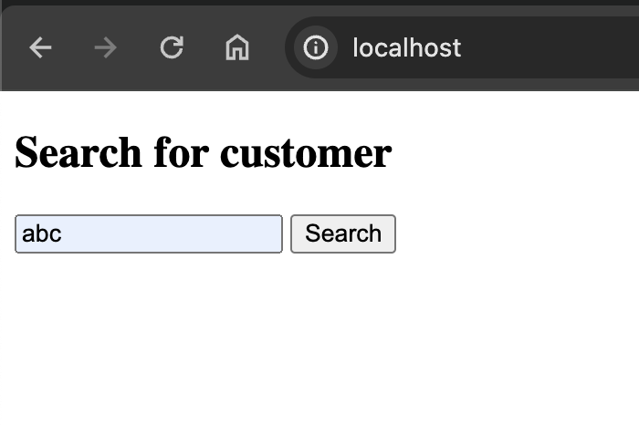
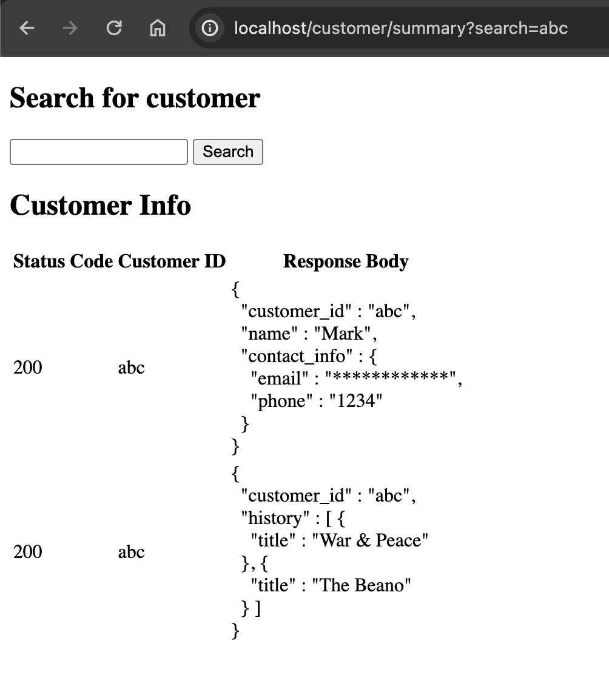
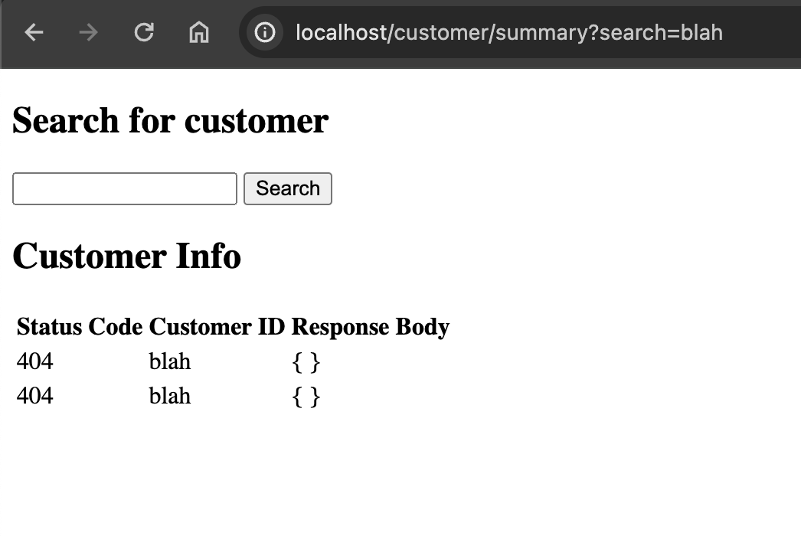

# Java Spring Boot API Proxy

Stateless UI/Proxy application used to call a series of external REST APIs and present the result back to the user.

### Tech stack
* Java 21
* Gradle 8
* Spring Boot
* Thymeleaf
* Jackson
* Docker
* Wiremock

### Running the application

**Docker Compose**
* `./gradlew build && docker-compose down && docker rmi -f javaspringbootapiproxy-application && docker-compose up -d`.
* An executable script has been written for convenience, run `./startup.sh` from the root of the project to stop and start the application and wiremock.

A useful command to keep an eye on running docker containers `watch -n1 'docker ps -a --format "table {{.ID}}\t{{.Names}}\t{{.Ports}}\t{{.Status}}"'`.

Once running, the app will be available at localhost on port 80, wiremock will be available on port 8080.

To shut everything down without re-running, just run `docker-compose down`.

### Endpoints

**Customer Summary Frontend (index.html):** 

The default search view of index.html is loaded by accessing http://localhost:80/ (http://localhost/).

Entering a customer id into the search box and clicking search adds the path and query param as shown below.

Example call with `customer_id` "abc" -> http://localhost/customer/summary?search=abc.

[//]: # (Add images to the readme when the frontend is complete.)
[//]: # (Returns all proxied API responses for a given customer_id &#40;"abc", see wiremock endpoints below&#41; to the frontend.)
[//]: # ()
[//]: # (
)
[//]: # (  )
[//]: # (   )
[//]: # (  )
[//]: # (   )
[//]: # (
)
[//]: # ()
[//]: # (If the given customer_id &#40;"blah" in the example below&#41; does not exist or cannot be returned for any other reason, this is handled and represented in the response.)
[//]: # ()
[//]: # (
)
[//]: # (  )
[//]: # (   )
[//]: # (
)

### Wiremock

Mappings are stored as JSON under the [wiremock/mappings](./wiremock/mappings) directory.

* View all mappings
  * http://localhost:8080/__admin/mappings
* API for customer account information; customer_id, name, etc. (customer_id "abc")
  * http://localhost:8080/customer/info/abc
* API for info on history of books borrowed by a given customer (customer_id "abc")
  * http://localhost:8080/customer/history/abc

### Sources
* mveeprojects.wordpress
  * [Good Thymes with Spring Boot](https://mveeprojects.wordpress.com/2017/11/11/good-thymes-with-spring-boot/).
* Spring.io
  * [Spring Boot getting started guide](https://spring.io/guides/gs/spring-boot).
  * [Spring Boot Gradle Plugin Reference Guide](https://docs.spring.io/spring-boot/docs/current/gradle-plugin/reference/htmlsingle/).
  * [Spring Boot Docker](https://spring.io/guides/topicals/spring-boot-docker).
* ThymeLeaf.org
  * [Tutorial: Thymeleaf + Spring](https://www.thymeleaf.org/doc/tutorials/2.1/thymeleafspring.html#creating-a-form).
* Baeldung
  * [Java HTTP Client](https://www.baeldung.com/java-9-http-client).
  * [Removing JSON Elements With Jackson](https://www.baeldung.com/java-jackson-remove-json-elements).
  * [Add CSS and JS to Thymeleaf](https://www.baeldung.com/spring-thymeleaf-css-js).
  * [Display Image With Thymeleaf](https://www.baeldung.com/java-thymeleaf-image).
* Adobe
  * [Free logo maker](https://new.express.adobe.com/tools/logo-maker?%24web_only=true&_branch_match_id=1230855816239834151&_branch_referrer=H4sIAAAAAAAAA8soKSkottLXT0zJT0otLkgsyi7ILy7RLU9N0kssKNDLyczL1k%2FVd05LDfcMD%2FIw9UgCAI8wjcoxAAAA).
* Miscellaneous
  * [SO: Keeping JSON whitepaces (pretty printing) in Thymeleaf](https://stackoverflow.com/questions/62822117/displaying-pretty-printed-json-from-variable-with-java-spring-boot-thymeleaf).
  * [SO: Create JSON object using Jackson in Java](https://stackoverflow.com/questions/40967921/create-json-object-using-jackson-in-java).
  * [SO: Search (via text field and button) in Spring MVC, CrudRepository, Thymeleaf](https://stackoverflow.com/questions/41314724/search-via-text-field-and-button-in-spring-mvc-crudrepository-thymeleaf).

### Todo

Must-haves:
* [x] Run dockerised wiremock instance with mocked JSON response of an external REST API.
* [x] Run the application and wiremock together in docker-compose.
* [x] Add code to call the external API and send the JSON to the frontend.
* [x] Render JSON of external API in "pretty print".
* [x] Handle errors gracefully (404 etc.).
* [x] Move hardcoded references to wiremock url etc and setup overridable config.
* [ ] Add basic auth to external API call.
* [ ] Create a simple UI using Thymeleaf.
  * [x] Form and button for inputting criteria to search by.
  * [ ] UI needs to be a bit prettier.
* [x] Add email to external API response JSON and obfuscate before sending in response to the frontend.

Nice-to-haves:
* [ ] Add equivalent curl (without auth) to the UI.
